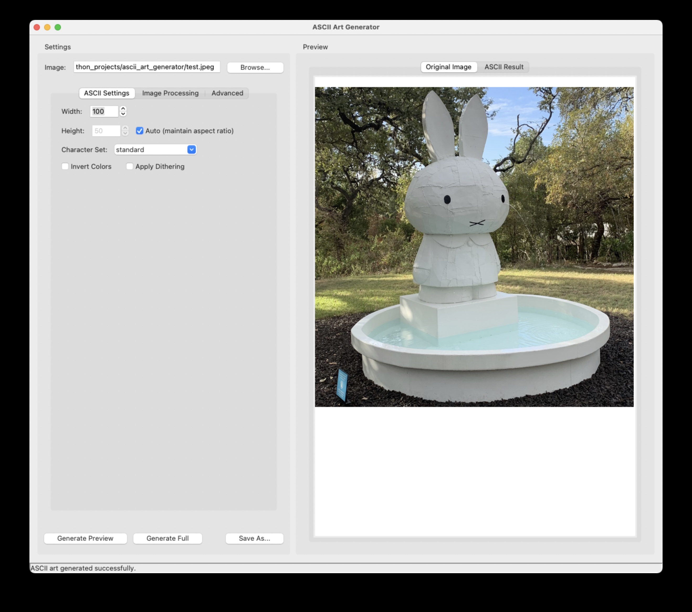
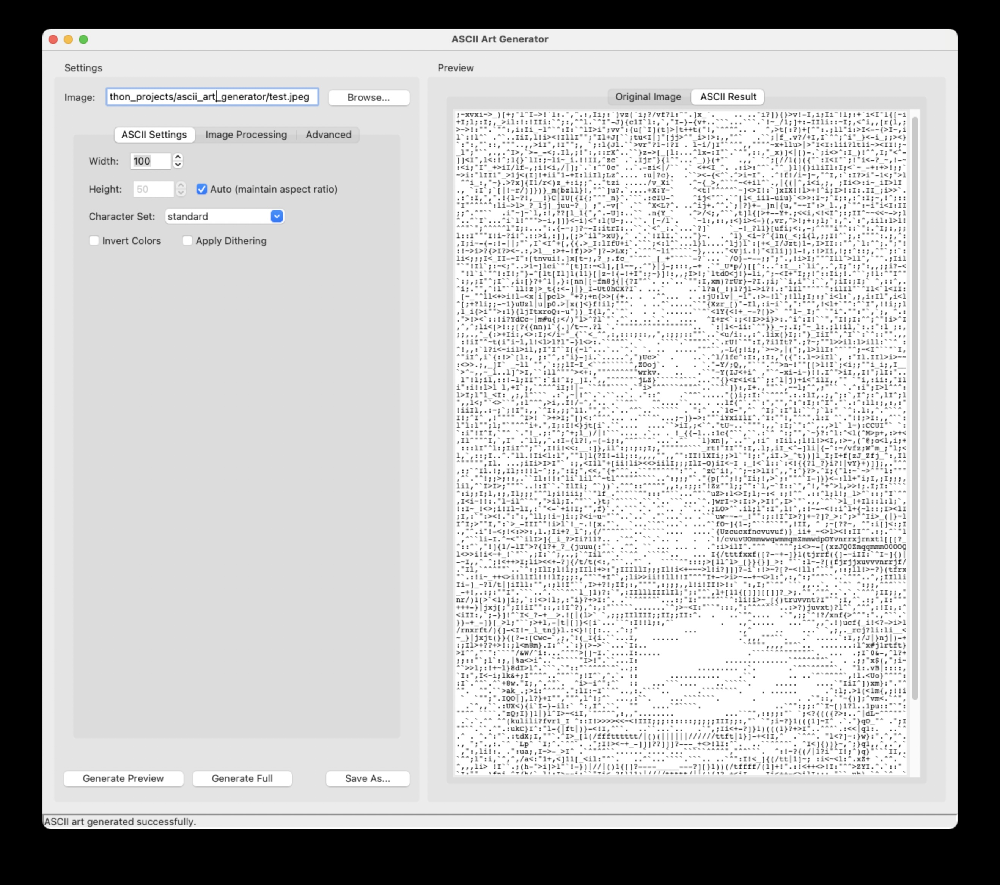

# ASCII Art Generator

A powerful Python application for converting images to high-quality ASCII art with extensive customization options.



## Features

- **Multiple character sets** - Choose from several predefined character sets or create your own
- **Advanced image processing** - Adjust contrast, brightness, sharpness, and apply special effects
- **Real-time preview** - See results quickly before generating the full ASCII art
- **Multiple output formats** - Save as text, HTML, or image files
- **User-friendly interface** - Intuitive controls with tabbed organization
- **High-Quality Conversion**: Produces detailed ASCII art with sophisticated density mapping
- **Expandable Architecture**: Modular design makes it easy to add new features or modify existing ones



## Installation

### Prerequisites

- Python 3.6+
- Required libraries:
  - PIL (Pillow)
  - Tkinter (included with Python)

### Setup

1. Clone the repository:
```bash
git clone https://github.com/gddickinson/ascii-art-generator.git
cd ascii-art-generator
```

2. Install required dependencies:
```bash
pip install pillow
```

3. Run the application:
```bash
python gui_application.py
```

## Usage

### Basic Usage

1. **Load an image** - Click "Browse..." or use File > Open Image
2. **Adjust settings** - Modify parameters in the different tabs
3. **Generate a preview** - Click "Generate Preview" for a quick low-resolution result
4. **Generate full** - Click "Generate Full" for complete ASCII art
5. **Save your work** - Use File > Save ASCII Art to save in your preferred format

### ASCII Settings

- **Width/Height** - Number of characters in the output
- **Character Set** - Different character collections for varied results
- **Invert Colors** - Reverse dark and light values
- **Apply Dithering** - Add texture to improve detail perception

### Image Processing

- **Contrast/Brightness/Sharpness** - Adjust image properties
- **Histogram Equalization** - Improve contrast across the entire range

### Advanced Settings

- **Preview Font** - Change display font size
- **Output Format** - Save as text, HTML, or image
- **Custom Characters** - Define your own density map

### Command Line Interface

The `ascii_art_generator.py` module can be used directly from the command line:

```bash
python ascii_art_generator.py input_image.jpg -o output.txt -w 100 --contrast 1.2 --brightness 1.1 --char-set standard --preview
```

Available options:

```
usage: ascii_art_generator.py [-h] [-o OUTPUT] [-w WIDTH] [-h HEIGHT] 
                              [-c {basic,standard,blocks,custom}] 
                              [--contrast CONTRAST] [--brightness BRIGHTNESS] 
                              [--invert] [--dither] [--preview] input

Convert images to ASCII art

positional arguments:
  input                 Input image file path

optional arguments:
  -h, --help            show this help message and exit
  -o OUTPUT, --output OUTPUT
                        Output file path (default: ascii_art.txt)
  -w WIDTH, --width WIDTH
                        Width of ASCII art in characters (default: 100)
  -h HEIGHT, --height HEIGHT
                        Height of ASCII art in characters (auto if not specified)
  -c {basic,standard,blocks,custom}, --char-set {basic,standard,blocks,custom}
                        Character set to use (default: standard)
  --contrast CONTRAST   Contrast adjustment (default: 1.0)
  --brightness BRIGHTNESS
                        Brightness adjustment (default: 1.0)
  --invert              Invert the image
  --dither              Apply dithering for better detail
  --preview             Preview the ASCII art in console
```

### Graphical User Interface

Run the GUI application for a more interactive experience:

```bash
python gui_application.py
```

1. Click "Browse..." to load an image
2. Adjust settings in the various tabs
3. Click "Generate Preview" for a quick preview
4. Click "Generate Full" for the final result
5. Save your ASCII art using File > Save ASCII Art

## Advanced Usage

### Image Preprocessing

The `image_processor.py` module provides extensive image processing capabilities that can significantly improve ASCII art quality:

```python
from image_processor import ImageProcessor

# Create processor and load image
processor = ImageProcessor()
processor.load("photo.jpg")

# Apply various enhancements
processor.resize(width=100)
processor.adjust_contrast(1.5)
processor.adjust_brightness(1.2)
processor.detect_edges(mode="sobel")
processor.apply_histogram_equalization()

# Get processed image
processed_img = processor.get_processed_image()

# Save for inspection if needed
processor.save("enhanced.jpg")
```

### Custom Character Sets

You can define your own character sets for unique ASCII art styles:

```python
from ascii_art_generator import ASCIIArtGenerator

# Define custom character set (from darkest to lightest)
ASCIIArtGenerator.CHAR_SETS['my_set'] = "@%#*+=-:. "

# Create generator with custom set
generator = ASCIIArtGenerator(char_set='my_set', width=100)
ascii_art = generator.convert_image("photo.jpg")
```

### Extending the Application

The modular architecture makes it easy to add new features:

1. **New Character Sets**: Add to the `CHAR_SETS` dictionary in `ASCIIArtGenerator`
2. **New Image Filters**: Add methods to the `ImageProcessor` class
3. **New Output Formats**: Extend the save functionality in the GUI application

## Example Results

For optimal results:

1. **High-Contrast Images**: Photos with clear subjects and good lighting work best
2. **Appropriate Width**: Start with width=100 and adjust based on your display
3. **Character Set Selection**: Different subjects work better with different character sets:
   - 'standard' is versatile for most images
   - 'basic' works well for simple, high-contrast images
   - 'blocks' can create interesting textured effects
   - Custom sets can be tailored to specific images

## Troubleshooting

Common issues and solutions:

1. **Blurry or Unclear Output**:
   - Increase contrast
   - Try edge enhancement
   - Use a character set with more distinct characters

2. **Too Dark/Light**:
   - Adjust brightness
   - Try inverting the image
   - Apply histogram equalization

3. **Missing Details**:
   - Increase the width parameter
   - Apply sharpening
   - Try dithering

4. **Performance Issues**:
   - Reduce image dimensions for preview
   - Use the preview mode before generating full resolution

## Error Handling

The application includes comprehensive error handling with detailed error messages:

- File access errors
- Image processing failures
- Invalid parameter combinations
- Output saving issues

## Project Structure

- `ascii_art_generator.py` - Core conversion logic
- `gui_application.py` - User-friendly graphical interface
- `image_processor.py` - Image preprocessing capabilities (advanced version only)

## Examples

For best results:

- **Portraits** - Use the 'standard' character set with higher width (120+)
- **Landscapes** - The 'basic' character set often works well
- **High-contrast images** - Try dithering for better details
- **Low-contrast images** - Apply histogram equalization

## Future Development

Here are some potential enhancements for future versions:

### Core Functionality

- **More Character Sets** - Add specialized sets for different image types
- **Color ASCII Art** - Support for colored ASCII using terminal colors or HTML
- **Animation Support** - Convert GIFs or video files to ASCII animations
- **Batch Processing** - Process multiple images with same settings

### Image Processing

- **Machine Learning Enhancement** - Use AI to improve edge detection and detail preservation
- **Style Transfer** - Apply artistic styles to images before ASCII conversion
- **Custom Filters** - Allow users to create and save custom filter combinations

### Interface Improvements

- **Themes** - Light/dark mode and custom color schemes
- **Layer Support** - Combine multiple ASCII images with different settings
- **Undo/Redo** - Full history of changes
- **Export Templates** - Custom HTML/CSS templates for web display

### Platform Extensions

- **Web Version** - Browser-based version with simplified controls
- **Mobile App** - Android/iOS versions
- **Editor Plugins** - Extensions for VS Code, Sublime Text, etc.

## Contributing

Contributions are welcome! Please feel free to submit a Pull Request.

1. Fork the repository
2. Create your feature branch (`git checkout -b feature/amazing-feature`)
3. Commit your changes (`git commit -m 'Add some amazing feature'`)
4. Push to the branch (`git push origin feature/amazing-feature`)
5. Open a Pull Request

## License

This project is licensed under the MIT License - see the LICENSE file for details.

## Acknowledgements

- Inspired by classic ASCII art generators
- Special thanks to the PIL/Pillow project
